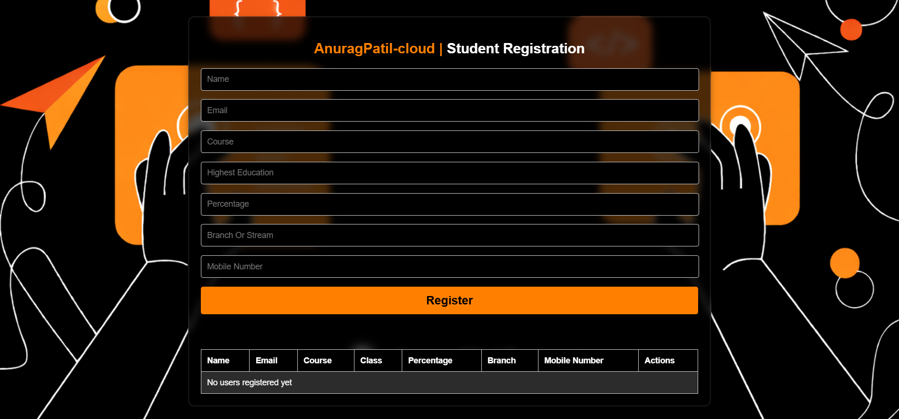
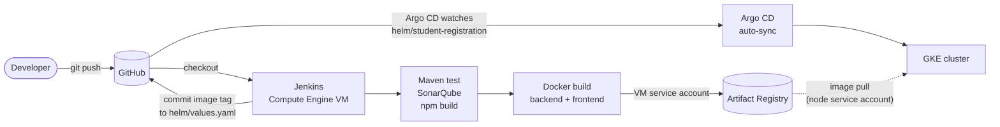
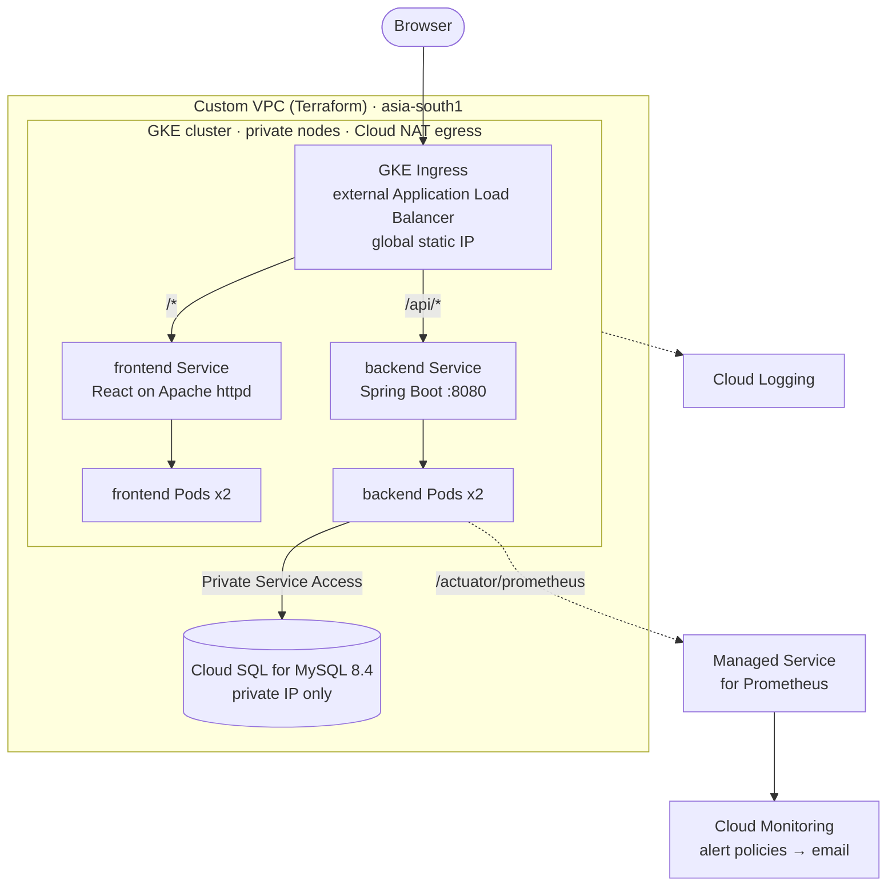

# 🎓 Student Registration — Full-Stack App on Google Cloud (GKE)

A cloud-native **Student Registration** application built with **React + Spring Boot + MySQL**, containerized with Docker, deployed on **Google Kubernetes Engine (GKE)**, provisioned with **Terraform**, automated end-to-end through a **Jenkins CI/CD pipeline** (with SonarQube analysis), stored in **Artifact Registry**, and released via **Helm** and **GitOps with Argo CD**.

This repo is a mini reference architecture for shipping a simple CRUD app the "real" DevOps way — **IaC → CI → CD → GitOps → Observability** — on Google Cloud.

<p align="center">
  
</p>

<p align="center">
  
  
  
  
  
  
  
  
  
  
  
  
</p>

---

## 📖 Table of Contents

- [Overview](#-overview)
- [Architecture](#-architecture)
- [Tech Stack](#-tech-stack)
- [Features](#-features)
- [Project Structure](#-project-structure)
- [Infrastructure (Terraform)](#-infrastructure-terraform)
- [CI/CD Pipeline](#-cicd-pipeline)
- [Screenshots](#-screenshots)
- [Getting Started Locally](#-getting-started-locally)
- [Deploy to GCP](#-deploy-to-gcp)
- [Environment Variables](#-environment-variables)
- [AWS → GCP Service Mapping](#-aws--gcp-service-mapping)
- [Security Notes](#-security-notes)
- [Roadmap](#-roadmap)
- [Author](#-author)

---

## 🧭 Overview

A student submits registration details (name, email, course, education, percentage, branch, mobile number) through a React form. The data is persisted in a **Cloud SQL for MySQL** database via a Spring Boot REST API, and can be listed or deleted from the same UI.

What makes this project interesting is everything around the app:

- **Infrastructure as Code** with Terraform — custom VPC, Cloud NAT, a private GKE cluster with an autoscaling node pool, Cloud SQL for MySQL (private IP), Artifact Registry, a Jenkins VM, IAM and Cloud Monitoring alerts
- **Containerized** frontend and backend with multi-stage Docker builds
- **CI** with Jenkins — test → static code analysis → build → dockerize → push to Artifact Registry → update Helm values
- **CD** with a Helm chart + Argo CD for GitOps-style automated sync to the cluster
- **Ingress** via the built-in GKE Ingress controller (external Application Load Balancer, global static IP)
- **Observability** via Cloud Logging, Google Cloud Managed Service for Prometheus (scrapes the backend's `/actuator/prometheus`) and Cloud Monitoring alerts

> This is the GCP edition of the project, ported from the AWS/EKS build. The application code and UI are unchanged except for the database driver (MariaDB → MySQL, see [AWS → GCP Service Mapping](#-aws--gcp-service-mapping)); the infrastructure, pipeline and deployment layer are rebuilt for Google Cloud.

---

## 🏗 Architecture

### Delivery flow



### Runtime on Google Cloud



The browser only talks to one address. The Ingress splits traffic by path: `/api/*` goes to the Spring Boot backend, everything else to the React frontend (served by Apache httpd). The frontend is built with `VITE_API_URL=/api`.

---

## 🛠 Tech Stack

| Layer               | Technology                                                    |
|---------------------|----------------------------------------------------------------|
| Frontend            | React 18, Vite, React Router, Axios                            |
| Backend             | Java 17, Spring Boot 3.3, Spring Data JPA, Lombok, Actuator    |
| Database            | Cloud SQL for MySQL 8.4 (private IP)                           |
| Containerization    | Docker (multi-stage builds), Docker Compose                    |
| Orchestration       | Kubernetes (Google GKE), Helm                                  |
| GitOps              | Argo CD                                                        |
| CI/CD               | Jenkins, SonarQube                                             |
| Infrastructure      | Terraform (VPC, NAT, GKE, Cloud SQL, Artifact Registry, IAM, VM, alerts) |
| Ingress             | GKE Ingress (external Application Load Balancer, global static IP) |
| Registry            | Artifact Registry                                              |
| Monitoring/Logs     | Cloud Logging, Managed Service for Prometheus, Cloud Monitoring |

---

## ✨ Features

- 📝 Student registration form (name, email, course, highest education, percentage, branch, mobile number)
- 📋 Live table of all registered students
- 🗑️ Delete a registered student record
- 🔌 REST API (`/api/register`, `/api/users`, `/api/users/{id}`) backed by MySQL
- ❤️ Health and metrics endpoints via Spring Boot Actuator (`/actuator/health`, `/actuator/prometheus`)
- 🐳 Fully dockerized frontend (Apache httpd serving the Vite build) and backend (JRE Alpine image)
- ☸️ Kubernetes-native deployment via Helm (Deployments, Services, Ingress, PodMonitoring)
- 🔁 GitOps delivery — Argo CD auto-syncs whatever is committed to `helm/student-registration`
- 🚦 Jenkins pipeline that tests, scans (SonarQube), builds, pushes images, and bumps the Helm chart automatically
- ☁️ One-command infra provisioning with Terraform

---

## 📁 Project Structure

```
student_Registration-GCP/
├── frontend/                     # React (Vite) app
│   ├── src/
│   │   ├── components/           # RegistrationForm, Modal
│   │   ├── hooks/                # useRegistrationForm
│   │   └── api/                  # userService (Axios calls)
│   └── dockerfile                # multi-stage: node build → httpd runtime
│
├── backend/                      # Spring Boot app
│   ├── src/main/java/.../
│   │   ├── controller/           # UserController (REST endpoints)
│   │   ├── model/                # User entity
│   │   ├── repository/           # UserRepository (Spring Data JPA)
│   │   └── config/               # WebConfig (CORS)
│   └── dockerfile                # multi-stage: maven build → JRE alpine runtime
│
├── helm/
│   ├── student-registration/     # Helm chart used by Argo CD
│   │   ├── Chart.yaml
│   │   ├── values.yaml           # image repos/tags, replicas, static IP name
│   │   └── templates/            # Deployments, Services, Ingress, PodMonitoring, Namespace
│   └── db-secret.example.yaml    # template for the DB credentials Secret (applied by hand)
│
├── argocd/
│   └── student-registration.yaml # Argo CD Application manifest (auto-sync)
│
├── GCP/terraform/                # Infrastructure as Code
│   ├── apis.tf  vpc.tf  nat.tf  firewall.tf  iam.tf
│   ├── artifact-registry.tf  jenkins.tf  gke.tf  cloudsql.tf  monitoring.tf
│   ├── variables.tf  outputs.tf  providers.tf
│   ├── terraform.tfvars.example
│   └── scripts/jenkins-startup.sh
│
├── scripts/update-helm-values.sh # used by Jenkins to bump image repo/tag in values.yaml
├── screenshots/                  # Screenshots used in this README
├── Jenkinsfile                   # CI/CD pipeline definition
├── compose.yml                   # docker compose for local dev (MySQL + backend + frontend)
└── README.md
```

---

## 🧱 Infrastructure (Terraform)

Everything under [`GCP/terraform`](./GCP/terraform) is created with one `terraform apply`. Defaults target the **`asia-south1` (Mumbai)** region.

| File | Provisions |
|---|---|
| `apis.tf` | Enables the Google APIs the project needs |
| `vpc.tf` · `nat.tf` | Custom VPC, a VM subnet and a GKE subnet with Pod/Service secondary ranges, Cloud Router + Cloud NAT |
| `firewall.tf` | Admin-IP-only rules for Jenkins, SonarQube and SSH (SSH also through IAP) |
| `iam.tf` | Service accounts for the Jenkins VM and GKE nodes, with Artifact Registry access granted on the repository only — no keys |
| `artifact-registry.tf` | Docker repository holding the `backend` and `frontend` images |
| `jenkins.tf` | Jenkins + SonarQube VM (`e2-standard-2`, 40 GB disk) bootstrapped by `scripts/jenkins-startup.sh` |
| `gke.tf` | GKE cluster on the `REGULAR` release channel: private nodes, Workload Identity, managed Prometheus, and an autoscaling node pool of `e2-standard-2` nodes (2 initial, 1–3 range) |
| `cloudsql.tf` | Cloud SQL for MySQL 8.4 (`db-g1-small`), private IP only via Private Service Access, automated backups |
| `monitoring.tf` | Email notification channel and alert policies: Jenkins VM CPU, Cloud SQL CPU, Cloud SQL disk |

---

## 🔄 CI/CD Pipeline

The [`Jenkinsfile`](./Jenkinsfile) runs on the Terraform-provisioned Jenkins VM:

1. **Checkout** — pull source from GitHub
2. **Verify Tooling** — Java, Maven, Node, Docker, gcloud
3. **Verify GCP** — read the project ID from the metadata server, confirm the Artifact Registry repository exists
4. **Backend Test** — `mvn clean test` (in-memory H2 database)
5. **SonarQube Analysis** — `mvn sonar:sonar`
6. **Frontend Build** — `npm ci && npm run build`
7. **Build Images** — backend and frontend (`VITE_API_URL=/api` build arg), tagged with the Jenkins `BUILD_NUMBER`
8. **Push to Artifact Registry** — `gcloud auth print-access-token | docker login`, then `docker push`
9. **Update Helm Values** — `scripts/update-helm-values.sh` rewrites `image.repository` and `image.tag` in `helm/student-registration/values.yaml`
10. **Commit & Push Helm Change** — commit the new tag back to `main`

Argo CD watches `helm/student-registration` and **automatically syncs** the new image tags to the GKE cluster — the GitOps loop needs no manual `kubectl apply`.

No Google Cloud keys are stored in Jenkins: the Jenkins VM runs as a Terraform-created service account that may push to the one Artifact Registry repository.

---

## 📸 Screenshots

### Application

<p align="center">
  
</p>

<!--
  Add GCP screenshots here as you capture them, then reference them like the one above:
  terraform apply output, GKE workloads, Cloud SQL instance, Jenkins pipeline + SonarQube,
  Artifact Registry images, Argo CD application, Ingress / load balancer, Cloud Logging,
  Managed Prometheus metrics, Cloud Monitoring alert policies.
-->

---

## 🚀 Getting Started Locally

### Prerequisites

- Docker & Docker Compose
- (optional) Node.js 18+ and npm, Java 17 + Maven, to run the services without Docker

### Option 1 — Docker Compose (fastest)

```bash
git clone https://github.com/AnuragPatil-cloud/student_Registration-GCP.git
cd student_Registration-GCP

docker compose up --build
```

- Frontend → `http://localhost`
- Backend → `http://localhost:8080` (health: `/actuator/health`)
- MySQL → `localhost:3306` (local-only credentials are in `compose.yml`)

### Option 2 — Run services manually

**Database** — any MySQL 8.x, for example `docker run -d -p 3306:3306 -e MYSQL_ROOT_PASSWORD=change-me -e MYSQL_DATABASE=student_registration mysql:8.4`

**Backend** (details in [`backend/Readme.md`](./backend/Readme.md))

```bash
cd backend
export DB_USER=root DB_PASSWORD=change-me
./mvnw spring-boot:run
```

**Frontend**

```bash
cd frontend
echo 'VITE_API_URL=http://localhost:8080/api' > .env
npm install
npm run dev
```

---

## ☁️ Deploy to GCP

> ⚠️ This creates billable resources (GKE, Cloud NAT, a VM, Cloud SQL, static IPs, a load balancer). Tear it down when you are done (see step 9).

**0. Prerequisites** — a GCP project with billing enabled, the `gcloud` CLI (with `gke-gcloud-auth-plugin`), `kubectl` and Terraform ≥ 1.6.

```bash
gcloud auth login && gcloud auth application-default login
gcloud config set project YOUR_PROJECT_ID
gcloud services enable serviceusage.googleapis.com cloudresourcemanager.googleapis.com
```

**1. Provision the infrastructure**

```bash
cd GCP/terraform
cp terraform.tfvars.example terraform.tfvars     # edit: project_id, admin_cidr, db_password, alert_email
terraform init && terraform validate
terraform plan
terraform apply
```

This creates the VPC, Cloud NAT, private GKE cluster, Cloud SQL (MySQL 8.4, private IP), Artifact Registry repository, Jenkins VM, IAM and alert policies. Confirm the verification email Google sends to `alert_email`. Cloud SQL can take 10–15 minutes.

**2. Connect to the cluster and create the database Secret**

```bash
$(terraform output -raw gke_get_credentials_command)      # configures kubectl

cd ../..
cp helm/db-secret.example.yaml helm/db-secret.yaml        # gitignored
# edit helm/db-secret.yaml: DB_HOST = `terraform output cloudsql_private_ip`, DB_PASSWORD = your db_password
kubectl create namespace student-registration
kubectl apply -f helm/db-secret.yaml
```

The kubectl commands work because the GKE API endpoint accepts your `admin_cidr`. Update `admin_cidr` and re-apply if your IP changes.

**3. Configure Jenkins**

```bash
$(cd GCP/terraform && terraform output -raw jenkins_ssh_command)
sudo cat /var/lib/jenkins/secrets/initialAdminPassword      # on the VM (first boot takes a few minutes)
```

Open `http://<jenkins_public_ip>:8080` (and SonarQube at `:9000`, default login `admin` / `admin`, change it immediately), install the suggested plugins plus **SonarQube Scanner**, then:

- In SonarQube, create a token. In Jenkins → *Manage Jenkins → System*, add a SonarQube server named **`SonarQube`** (URL `http://localhost:9000`) with that token as a *Secret text* credential.
- Add a *Username with password* credential with ID **`github-credentials`** (GitHub username + a personal access token with push rights).
- Create a **Pipeline** job: *Pipeline script from SCM* → this repository → branch `main` → script path `Jenkinsfile`.

**4. First build** — run the job. It tests, scans, builds and pushes `backend` and `frontend` to Artifact Registry, then commits the new `image.repository`/`image.tag` to `helm/student-registration/values.yaml` on `main`. (Until that first build has pushed images, the pods would show `ImagePullBackOff`; that is why the build comes before Argo CD.)

**5. Install Argo CD and hand over delivery**

```bash
kubectl create namespace argocd
kubectl apply -n argocd --server-side -f https://raw.githubusercontent.com/argoproj/argo-cd/stable/manifests/install.yaml

kubectl apply -f argocd/student-registration.yaml
kubectl get applications -n argocd
kubectl -n argocd get secret argocd-initial-admin-secret -o jsonpath='{.data.password}' | base64 -d; echo
kubectl -n argocd port-forward svc/argocd-server 8081:443     # UI: https://localhost:8081
```

If the GitHub repository is private, register it in Argo CD first (Settings → Repositories, with a personal access token). From now on, any push to `helm/student-registration/values.yaml` (for example a new image tag from Jenkins) is synced automatically.

**6. Open the app**

```bash
kubectl get ingress -n student-registration
terraform -chdir=GCP/terraform output ingress_static_ip
```

The Ingress uses the static IP Terraform reserved (`ingress.staticIpName` in `values.yaml`). The load balancer takes several minutes to provision and pass its health checks; `404`/`502` responses in the first minutes are normal. Then browse to `http://<ingress_static_ip>`.

**7. Observe**

- **Logs** — Cloud Logging → Logs Explorer (resource type *Kubernetes Container*, namespace `student-registration`)
- **Metrics** — Cloud Monitoring → Metrics Explorer → *Prometheus Target* metrics (scraped from `/actuator/prometheus` by the `PodMonitoring` in the chart)
- **Alerts** — Cloud Monitoring → Alerting (Jenkins VM CPU, Cloud SQL CPU, Cloud SQL disk) → email

**8. Useful checks**

```bash
kubectl get pods,svc,ingress -n student-registration
kubectl top nodes && kubectl top pods -n student-registration
kubectl logs -n student-registration deploy/student-registration-backend
```

**9. Tear down**

```bash
kubectl delete -f argocd/student-registration.yaml        # stops Argo CD from re-creating anything (does not delete the app)
kubectl delete ingress --all -n student-registration       # removes the load balancer GKE created for the Ingress
# wait a few minutes for the load balancer, NEGs and their firewall rules to disappear, then:
terraform -chdir=GCP/terraform destroy
```

---

## 🔑 Environment Variables

**Backend** — read from the environment by `application.properties`; in Kubernetes they come from the `student-registration-db-secret` Secret

| Variable | Default | Description |
|---|---|---|
| `DB_HOST` | `localhost` | Database host (Cloud SQL private IP on GCP) |
| `DB_PORT` | `3306` | Database port |
| `DB_NAME` | `student_registration` | Database name |
| `DB_USER` | none (required) | Database user |
| `DB_PASSWORD` | none (required) | Database password |

**Frontend** — build-time, `frontend/.env` or a Docker build arg

| Variable | Description |
|---|---|
| `VITE_API_URL` | Base URL of the backend API. `/api` behind the Ingress (set by Jenkins), `http://localhost:8080/api` locally |

---

## 🔁 AWS → GCP Service Mapping

| AWS (previous edition) | GCP (this edition) |
|---|---|
| VPC, public/private subnets, IGW, NAT Gateway | Custom VPC, VM and GKE subnets, Cloud Router + Cloud NAT |
| EKS + managed node group | GKE (private nodes) + autoscaling node pool |
| RDS for MariaDB 10.11 | **Cloud SQL for MySQL 8.4** — Cloud SQL has no MariaDB, so the backend's JDBC driver changed from `mariadb-java-client` to `mysql-connector-j` and the URL to `jdbc:mysql://` |
| RDS subnet group + security group | Private Service Access (private IP inside the VPC) |
| ALB + AWS Load Balancer Controller | GKE Ingress (external Application Load Balancer, built in — nothing to install) + global static IP |
| Docker Hub | Artifact Registry |
| Manually created EC2 for Jenkins | Jenkins VM provisioned by Terraform |
| IAM roles for the cluster/nodes | Service accounts (no keys); Artifact Registry access granted on the repository |
| CloudWatch Logs | Cloud Logging |
| `kubectl top` only | Managed Service for Prometheus + Cloud Monitoring alert policies |

Other deliberate differences: the Helm Ingress uses the `kubernetes.io/ingress.class: "gce"` annotation (GKE does not support `spec.ingressClassName`) with `/api/*` and `/*` paths, and the chart no longer creates the namespace by default (Argo CD does, via `CreateNamespace=true`).

---

## 🛡 Security Notes

- **Network** — GKE nodes are private (outbound through Cloud NAT), Cloud SQL has no public IP, and Jenkins, SonarQube, SSH and the Kubernetes API are reachable only from your `admin_cidr` (SSH also through IAP).
- **Credentials** — the database password lives in a Kubernetes Secret applied by hand (never in Git) and in your local, gitignored `terraform.tfvars`. Jenkins authenticates to Google Cloud as its VM service account; no service account keys are created.
- **Demo limitations** — the REST API has no authentication and CORS allows any origin, so anyone who can reach the app can list and delete registrations. Traffic is plain HTTP. Fine for a demo; see the roadmap before any real use.

---

## 🗺 Roadmap

- HTTPS with a Google-managed certificate and a domain name (`ManagedCertificate` / Gateway API)
- Authentication on the API, and restricting CORS to the app's own origin
- Workload Identity + Secret Manager instead of a hand-applied Kubernetes Secret, or the Cloud SQL Auth Proxy sidecar
- Remote Terraform state in Cloud Storage (`GCP/terraform/backend.tf.example`) and a separate staging environment
- A dedicated Cloud SQL user per environment and a regional (HA) instance for production
- HorizontalPodAutoscaler for the backend

---

## 👤 Author

**Anurag Patil**

- GitHub: [AnuragPatil-cloud](https://github.com/AnuragPatil-cloud)
- LinkedIn: [linkedin.com/in/anuragpatil17](https://www.linkedin.com/in/anuragpatil17)
